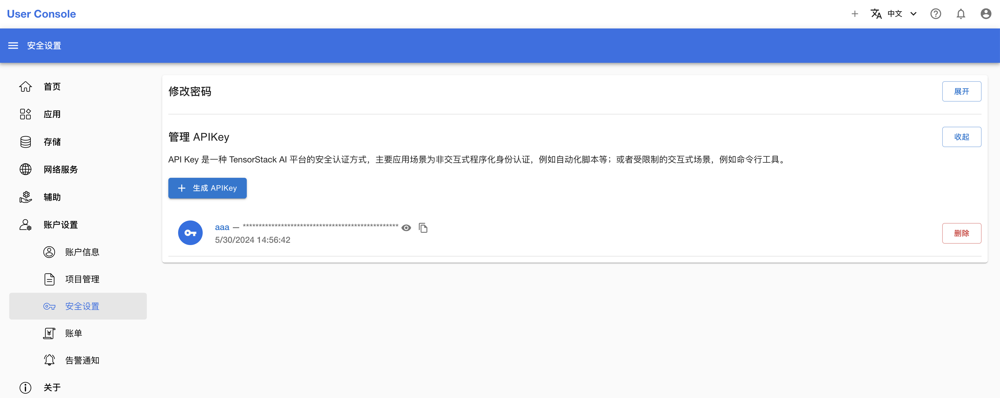
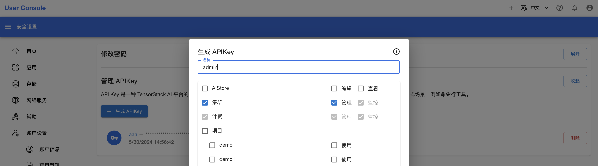
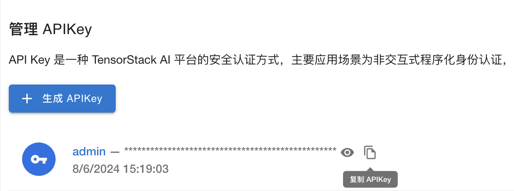

# Appendix

[中文](./appendix_zh.md)

## Command-Line Tool - t9k-app

Administrators use the command-line tool `t9k-app` to manage Apps.

### Download

Get the latest `t9k-app` command-line tool from [https://github.com/t9k/user-manuals/releases](https://github.com/t9k/user-manuals/releases).

For example, on a Linux operating system, execute the following commands in the command line:

```bash
wget https://github.com/t9k/user-manuals/releases/download/2024-07-21/t9k-app-linux-amd64
mv t9k-app-linux-amd64 t9k-app
sudo chmod +x t9k-app
```

### List Apps

```bash
t9k-app list -s <server> -k <apikey>
```

**Parameters:**

*   `-k`: [Required] An API Key with administrator privileges.
*   `-s`: [Required] The App Server service address.

**Output:**

```
NAME               DISPLAY NAME                DEFAULT VERSION     CATEGORIES
codeserver         Code Server                 0.1.2               Tool
comfyui            ComfyUI                     0.1.1               AI
dify               Dify                        0.3.7               AI
filebrowser        FileBrowser                 0.1.2               Tool
fish-speech        Fish Speech                 0.1.0               AI
gpt-researcher     GPT Researcher              0.1.5               AI
job-manager        Job Manager                 0.1.2               Tool, AI
jupyterlab-cpu     JupyterLab (CPU)            0.1.2               IDE
jupyterlab-gpu     JupyterLab (Nvidia GPU)     0.1.2               IDE
label-studio       Label Studio                1.4.8               AI, Tool
```

### Register/Update Apps

```bash
t9k-app register -f <template.yaml> -s <server> -k <apikey> [flags]
```

**Parameters:**

*   `-f`: [Required] The path to the application template.
    *   You can use the `-f` parameter multiple times in a single command to read multiple application templates, e.g., `t9k-app register -f template-1.yaml -f template-2.yaml`.
    *   The application template path can include wildcards. `t9k-app` will read all matching application templates, e.g., `t9k-app register -f "apps/t9k_*/template.yaml"`.
*   `-k`: [Required] An API Key with administrator privileges.
*   `-s`: [Required] The App Server service address.
*   `-u`: If the application already exists, update it.
    *   If the application already exists and this parameter is not set, the application will not be registered.
*   `-v`: Log level. The larger the number, the more detailed the log information. The default is 0.

### Unregister Apps

```bash
t9k-app unregister <app-name> -s <server> -k <apikey>
```

**Parameters:**

*   `<app-name>`: [Required] The name of the application, not the display name.
*   `-k`: [Required] An API Key with administrator privileges.
*   `-s`: [Required] The App Server service address.
*   `-v`: Log level. The larger the number, the more detailed the log information. The default is 0.

## Get Administrator API Key

Log in to the User Console with an administrator account and navigate to the **Account Settings > Security Settings** page from the left navigation bar:



Click the **Generate API Key** button, select the **Cluster - Admin** permission from the permission list, and generate the API Key:



After generating the API Key, click the copy button to copy the API Key:


