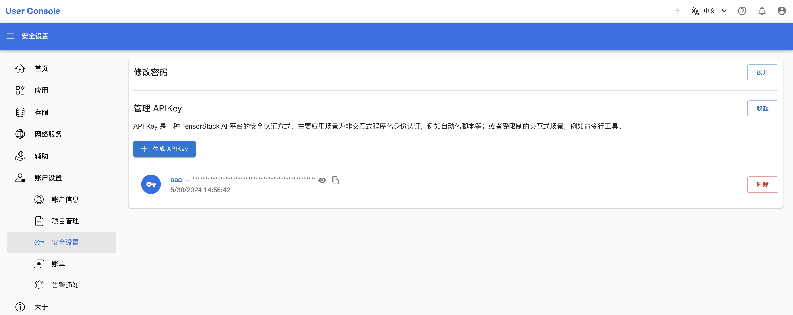

# 附录

[English](./appendix.md)

## 命令行工具  -  t9k-app

管理员使用命令行工具 t9k-app 管理 Apps。

### 下载方式

从 https://github.com/t9k/user-manuals/releases 中获取最新的 t9k-app 命令行工具。

以 Linux 操作系统为例，在命令行中执行以下命令：

```bash
wget https://github.com/t9k/user-manuals/releases/download/2024-07-21/t9k-app-linux-amd64
mv t9k-app-linux-amd64 t9k-app
sudo chmod +x t9k-app
```

### 列举 Apps

```bash
t9k-app list -s <server> -k <apikey>
```

参数说明：

* `-k`：[必填] 一个具有管理员权限的 API Key。
* `-s`：[必填] App Server 服务地址。

输出结果：

```
NAME               DISPLAY NAME                DEFAULT VERSION     CATEGORIES
codeserver         Code Server                 0.1.2               Tool
comfyui            ComfyUI                     0.1.1               AI
dify               Dify                        0.3.7               AI
filebrowser        FileBrowser                 0.1.2               Tool
fish-speech        Fish Speech                 0.1.0               AI
gpt-researcher     GPT Researcher              0.1.5               AI
job-manager        Job Manager                 0.1.2               Tool, AI
jupyterlab-cpu     JupyterLab (CPU)            0.1.2               IDE
jupyterlab-gpu     JupyterLab (Nvidia GPU)     0.1.2               IDE
label-studio       Label Studio                1.4.8               AI, Tool
```

### 注册/更新 Apps

```bash
t9k-app register -f <template.yaml> -s <server> -k <apikey> [flags]
```

参数说明：

* `-f`：[必填] 应用模版路径。
  * 一条命令中可以多次使用 `-f` 参数，读取多个应用模版，如 `t9k-app register -f template-1.yaml -f template-2.yaml`。
  * 应用模版路径可以包含通配符，`t9k-app` 会读取所有匹配的应用模版，如 `t9k-app register -f "apps/t9k_*/template.yaml"`。
* `-k`：[必填] 一个具有管理员权限的 API Key。
* `-s`：[必填] App Server 服务地址。
* `-u`：如果应用已经存在，则更新该应用。
  * 如果应用已经存在且未设置该参数，则不注册该应用。
* `-v`：日志等级。数字越大，日志的信息量越多，默认为 0。

### 注销 Apps

```bash
t9k-app unregister <app-name> -s <server> -k <apikey>
```

参数说明：

* `<app-name>`：[必填] 应用的名称，注意不是展示名称（display name）。
* `-k`：[必填] 一个具有管理员权限的 API Key。
* `-s`：[必填] App Server 服务地址。
* `-v`：日志等级。数字越大，日志的信息量越多，默认为 0。

## 获取管理员 API Key

使用管理员账号登录 User Console，并通过左侧导航栏进入 **账户设置 > 安全设置** 页面：



点击 **生成 API Key 按钮**，在权限列表中选择 **集群 - 管理** 权限，生成 API Key：


生成 API Key 后，点击复制按钮复制 API Key：


