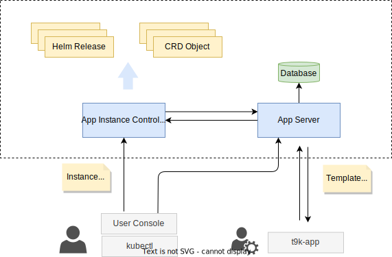

# 概述

应用（Apps），指在 TensorStack AI 集群中实现特定功能、可独立安装、卸载的软件模块。目前，TensorStack AI 平台支持以 Helm Chart 和 CRD 两种形式定义 Apps，其它方式（例如 Operator），如有需要可另行扩展。

<b>图1：TensorStack 平台 Apps 系统架构示意图。1）App Server 提供 Apps 注册、查看等接口；2）管理员通过 t9k-app 命令行工具管理可部署的应用；3）用户通过 User Console 或 kubectl 创建  Instance CRD 对象以安装 Apps；AIC 监听到 CRD 对象后，从 App Server 处获取应用信息并部署到集群中。</b>

Apps 系统由以下组件构成：

1. App Server：提供应用管理 API，包括应用注册、注销、查询等操作。
2. App Instance Controller (AIC)：应用实例控制器，负责处理用户的应用安装和卸载请求。AIC 自动化地把 Apps 以 Helm Release 或 CRD Object 的形式部署（安装）在集群中。
3. t9k-app：命令行工具，管理员通过该工具注册、注销应用。
4. User Console：Web 前端，用户通过该前端安装、管理、及使用 Apps。

## 下一步

* 了解如何 [注册和注销 Apps](./register.md)
* 了解 [应用模版的格式](./template.md)
* 了解如何 [开发 App](./dev.md)
